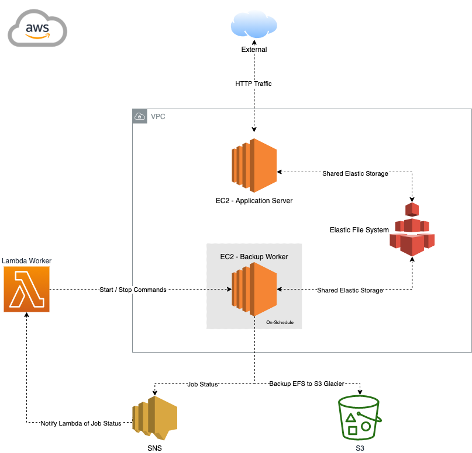

# AWS EFS Infrastructure as Code and Backup to S3 Glacier

## Architecture



## Setup

Before you start, set the following local environment variables on your host (Linux/MacOS):

```bash
export WORKER_AWS_PROFILE=XXX
export VPC_ID=XXX
export ACCOUNT_ID=XXX
export REGION=XXX
export KEY_PAIR_NAME=XXX
export NOTIFICATION_EMAIL=XXX
export WORKER_BUCKET_NAME=XXX
```

Upload ```scrips/lambda_worker.py``` to the root of an S3 Bucket - ```WORKER_BUCKET_NAME``` - in your AWS Account. 

The following EC2 Worker variables will be automatically set by IaC for you during deployment:

```bash
export SOURCE_DIR=XXX
export EFS_BUCKET_NAME=XXX
export TOPIC_ARN=XXX
```

The following Lambda Worker environment variables will be automatically set by IaC for you during deployment:

```bash
export INSTANCE_ID=XXX
```

## Development

Install the CDK for IaC:

```
$ npm install -g aws-cdk
$ cdk --version
```

Activate MacOS/Linux virtual environment:

```
$ source .venv/bin/activate
```

Once the virtualenv is activated, you can install the required dependencies:

```
$ pip install -r requirements.txt
```

If dependencies are changed, you can update dependency requirements:

```
$ pip freeze > requirements.txt
```

Update dependencies currently installed:

```
$ pip install -r requirements.txt --upgrade
```

At this point you can now synthesize the CloudFormation template for this code.

```
$ cdk synth
```

## Deployment

* `cdk ls`                         list all stacks in the app
* `cdk synth`                      emits the synthesized CloudFormation template
* `cdk deploy --profile XXX`       deploy this stack to your default AWS account/region
* `cdk diff`                       compare deployed stack with current state
* `cdk docs`                       open CDK documentation
